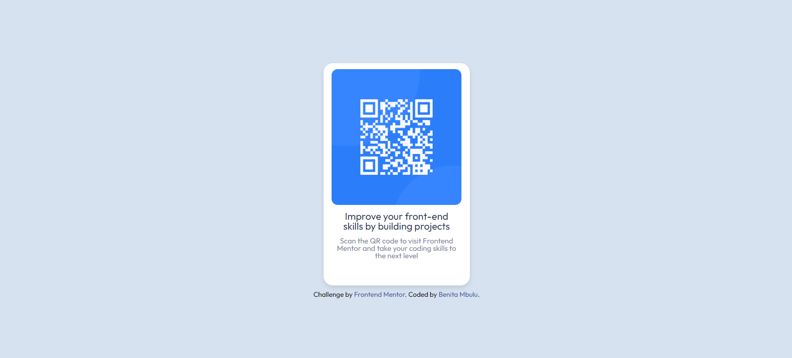

# qr-code
A qr-code project

# Frontend Mentor - QR code component solution

This is a solution to the [QR code component challenge on Frontend Mentor](https://www.frontendmentor.io/challenges/qr-code-component-iux_sIO_H). Frontend Mentor challenges help you improve your coding skills by building realistic projects. 

## Table of contents

- [Overview](#overview)
  - [Screenshot](#screenshot)
  - [Links](#links)
- [My process](#my-process)
  - [Built with](#built-with)
  - [What I learned](#what-i-learned)
  - [Continued development](#continued-development)
  - [Useful resources](#useful-resources)
- [Author](#author)


## Overview

This project is a responsive QR code card generator. The web page displays a QR code along with some descriptive text, optimized for both mobile and desktop viewing. Users can easily integrate this component into their own projects for quick access to information via QR code.

Key Features:
- **Responsive Design:** The QR code card adjusts seamlessly to different screen sizes, from mobile (375px) to desktop (1440px).
- **Customizable Content:** Easily replace the QR code image and descriptive text to suit your needs.
- **WCAG Compliance:** Ensures accessibility across a wide range of devices and screen sizes.
- **Modern Styling:** Utilizes modern CSS techniques, including Flexbox, to create a clean and attractive layout.
- **CSS Reset Included:** Incorporates Eric Meyer’s CSS reset for consistent rendering across different browsers.


### Screenshot




### Links

- Solution URL: [Add solution URL here](https://github.com/benitambulu/qr-code)
- Live Site URL: [Add live site URL here](https://benitambulu.github.io/qr-code/)


## My process

### Planning and Requirements Gathering
1. **Identify the Need:** Recognized the need for a responsive QR code card component to be used in various web projects.
2. **Research:** Reviewed existing QR code card designs and responsive web design principles.
3. **Define Requirements:** 
   - The card should be responsive and work on both mobile (375px) and desktop (1440px) screens.
   - It should be visually appealing and easy to integrate.
   - Ensure accessibility compliance (WCAG).
4. **Create Wireframes:** Sketched out basic wireframes for the mobile and desktop versions.

### Setup and Initial Development
1. **Project Setup:**
   - Created a new project directory.
   - Set up a basic HTML file structure.
2. **Add CSS Reset:**
   - Included Eric Meyer’s CSS reset to ensure consistent styling across browsers.
3. **Base HTML Structure:**
   - Developed the initial HTML structure, including the container div and QR code image placeholder.

### Styling and Responsiveness
1. **Apply Global Styles:**
   - Set global styles in the CSS, including font family, background color, and overall layout using Flexbox.
2. **Style the Card:**
   - Added CSS for the card, including dimensions, background color, box-shadow, and border-radius.
   - Ensured the card content is centered both horizontally and vertically.
3. **Responsive Design:**
   - Used media queries to adjust the layout and styling for different screen sizes.
   - Tested on multiple devices to ensure responsiveness.

### Accessibility and Testing
1. **Accessibility:**
   - Ensured all text had sufficient color contrast.
   - Added alt text for images.
   - Verified the structure and flow of content for screen readers.
2. **Testing:**
   - Conducted tests on various devices and browsers to ensure consistent appearance and behavior.
   - Used tools like Chrome DevTools to simulate different screen sizes.
   - Fixed any bugs or styling issues that arose during testing.

### Final Adjustments and Deployment
1. **Final Adjustments:**
   - Made minor tweaks to the layout and styling based on feedback and additional testing.
   - Optimized images for faster loading times.
2. **Deployment:**
   - Deployed the project to a web server (e.g., GitHub Pages, Netlify, or another hosting service).
   - Verified the live version of the site to ensure everything works as expected.


### Built with

- **HTML5:** For the structure of the web page.
- **CSS3:** For styling, including Flexbox for layout and Eric Meyer’s CSS reset.
- **Google Fonts:** For custom fonts (e.g., "Outfit").
- **Responsive Design Principles:** Ensuring the component works well on a variety of screen sizes.


### What I learned
I learned how to properly use the flexbox properties and tricks and it made my work really smooth and seamless.
Below are my favorite code snippets:

```css
body {
    display: flex;
    justify-content: center;
    align-items: center;
    height: 100vh;
    margin: 0;
    background-color: hsl(212, 45%, 89%);
    font-family: "Outfit", sans-serif;
}

#card {
    display: flex;
    flex-direction: column;
    align-items: center;
    width: 236px;
    height: 360px;
    background-color: hsl(0, 0%, 100%);
    border-radius: 15px;
    box-shadow: 0 4px 8px rgba(0,0,0,0.1);
    padding: 20px;
    text-align: center;
}

@media (max-width: 375px) {
    #card {
        width: 300px;
        height: auto;
    }

    #card h4 {
        font-size: 1.5rem;
    }

    #card p {
        font-size: 1rem;
    }
}
```


### Continued development

I found out about flex-direction and how it was able to help me align all the sections on my code well. I would love to practice more with it and other flex-box properties.


### Useful resources

- [A Complete Guide to Flexbox](https://css-tricks.com/snippets/css/a-guide-to-flexbox/) 

## Overview:
The Complete Guide to Flexbox by CSS-Tricks is an in-depth resource that covers all aspects of Flexbox layout, including flex container properties, flex item properties, and detailed examples.

## How It Helped:
Centering Elements: The guide provided clear instructions on how to use justify-content and align-items to center elements both horizontally and vertically within their container. This was particularly useful for aligning the card and its contents in the center of the page.
Responsive Design: It helped in understanding how to create responsive layouts that adjust flexibly to different screen sizes, ensuring that the card remains centered and proportionate on both mobile and desktop views.
Alignment and Spacing: The guide explained the use of properties like flex-direction, flex-wrap, and gap which were crucial in aligning the card’s internal elements such as images and text consistently.
Flexbox Examples: Provided practical examples and use cases which made it easier to visualize and implement Flexbox for creating a modern, responsive design.


## Author

- Website - [Benita Mbulu](https://benitambulu.github.io/myportfoliowebsite/)
- Frontend Mentor - [@yourusername](https://www.frontendmentor.io/profile/benitambulu)
- Twitter - [@yourusername](https://x.com/benitambulu_)


